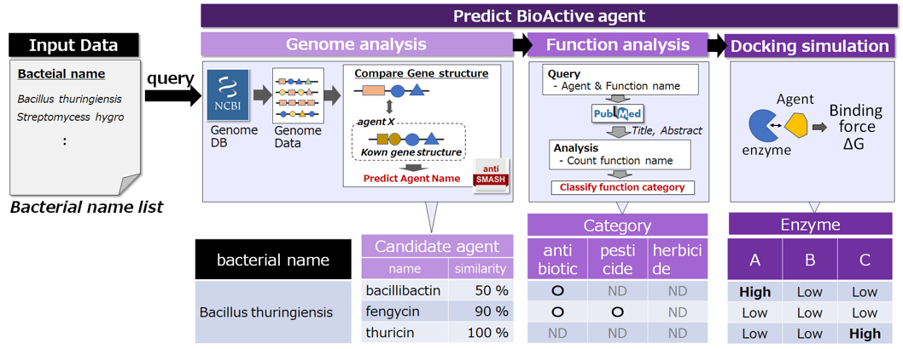
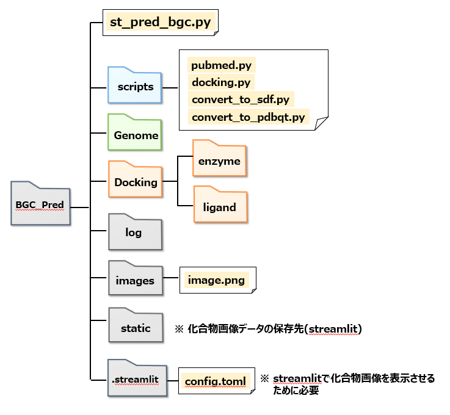
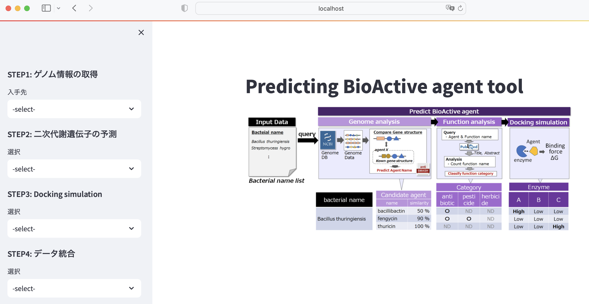

# BGC_Prediction_Tool 
微生物の二次代謝遺伝子（BGC）予測ツール
## 1. 概要
・スクリーニングの第一段階は、微生物ライブラリーからの供試菌株の選定である。

・BGC_Prediction_Toolは二次代謝遺伝子解析により、生物の潜在能力を評価する為のツールである。
## 2. 仕組み
・入力した菌株名から、[NCBIのゲノムDB](https://www.ncbi.nlm.nih.gov/)を検索し、ゲノムデータ(***.gbff.gz)をダウンロード

・[Antismash](https://github.com/antismash)を用いて二次代謝遺伝子を予測

・相同性が認められた既知二次代謝物遺伝子を抽出

・文献検索により、既知代謝物と農薬（抗菌/抗カビ、殺虫、除草）および抗ウィルスの関連性を推測

・上記解析データを包含したExcelデータを出力

## 3. 環境構築
(1) Conda環境設定

`conda create -n bgc_prediction_tool python`

`conda activate -n bgc_prediction_tool`

(2) ゲノム情報取得ツール

`pip install ncbi-genome-download`

(3) Antismash

`wget https://dl.secondarymetabolites.org/releases/7.0.0/antismash-7.0.0.tar.gz`

`tar -zxy antismash-7.0.0.tar.gz`

`pip install ./antismash-7.0.0`

`download-antismash-databases`

`conda install hmmer2 hmmer diamond=2.0.15 fasttree prodigal blast muscle glimmerhmm`

`conda install beautifulsoup4 lxml html5lib`

`download-antismash-databases`

(4) 文献検索（[pubmed](https://pubmed.ncbi.nlm.nih.gov/)）

`pip install biopython`

(5) 化合物の構造生成

`pip install rdkit-pypi`

`pip install pubchempy`

(6) Docking simulationツール（autodock vina）

`conda install -c conda-forge numpy swig boost-cpp sphinx sphinx_rtd_theme`

`conda install -c conda-forge openbabel`

`pip install vina`

`pip install oddt`

(7) その他

`pip install pandas`

`pip install openpyx`

`conda install -c conda-forge xlsxwriter`

`pip install streamlit`

## 4.フォルダ構造

・BGC＿Prediction＿Toolはフォルダ構造に依存するため下図の通りにフォルダ作成する必要あり

・gitの「BGC_pred」フォルダをダウンロードして使用を推奨

## 5.使用方法

(1) 作業環境構築

gitから「BGC_pred」フォルダをダウンロード

(2) streamlit起動

BGC_Predフォルダ下で、下記コマンドを実行（local_hostが立ち上がる）

`streamlit run st_pred_bgc.py`

(3) ゲノム情報の取得

 1) サイドバーのSTEP1 ゲノム情報の取得 -> NCBIを選択

 2) 菌株名が記載されたcsvファイル(例：File/bacterial_name_list.csv)をアップロードし、情報取得ボタンを押す

 3) ゲノム情報はGenomeフォルダ下に生成した菌株名フォルダ下に保存

(4) 二次代謝遺伝子の予測Ｉ

 1) サイドバーのSTEP2 二次代謝遺伝子の予測　-> Anti_smashを選択

 2) 解析開始ボタンを押すと、(3)で取得した全てのゲノムデータに対してAntismashを実行

 3) Genomeフォルダ下の菌株名フォルダ下にAntismashフォルダが生成、解析データ(antismash.csvと
    outline.csv)が生成

(5) 二次代謝遺伝子の予測Ⅱ

 1) サイドバーのSTEP2 二次代謝遺伝子の予測　->Predict_functionを選択

 2) 機能推定スタートを押すと、(4)で生成した全てのantismash.csvデータに対して機能推定を実施

 3) Genomeフォルダ下の菌株名フォルダ下にPred_funcフォルダが生成、解析データ(antismash.csvと
    outline.csv)が生成

(6) データ統合

 1) サイドバーのSTEP4 データ統合　->　antismash/pred_funcを選択

 2) 保存ファイル名を入力し、開始ボタンを押す

 3) 解析に供試した全ての菌株の解析データを統合したExcelファイルがBGC_Predフォルダ下に生成

## 6. 作業画面（フロント）

